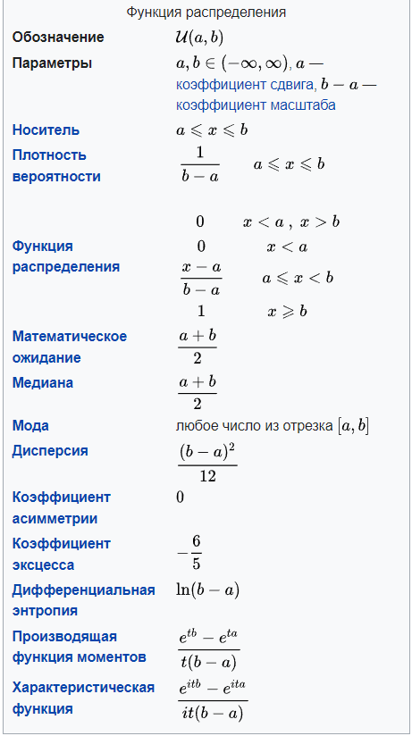

---

Среднее значение случайной непрерывной величины с равномерным распределением на промежутке [a, b] вычисляется по формуле:

```
E(A) = (a + b) / 2
```
В данном случае a = 200, b = 800, поэтому:

```
E(A) = (200 + 800) / 2 = 500
```
Дисперсия случайной непрерывной величины с равномерным распределением на промежутке [a, b] вычисляется по формуле:

```
D(A) = (b - a)^2 / 12
```
Подставляя значения a = 200, b = 800, получим:

```
D(A) = (800 - 200)^2 / 12 = 36000
```
Ответ: среднее значение E(A) = 500, дисперсия D(A) = 36000.