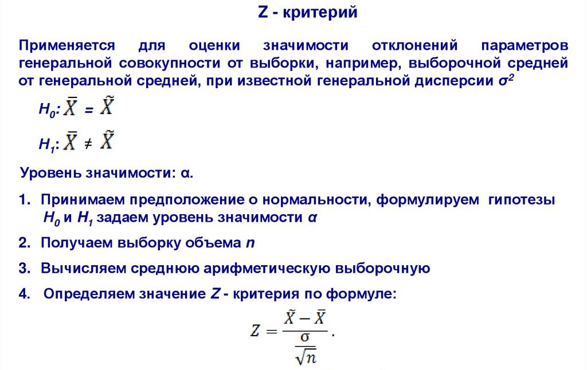

---

Проведите тест гипотезы. Утверждается, что шарики для подшипников, изготовленные автоматическим станком, имеют средний диаметр 17 мм.  
Используя односторонний критерий с α=0,05, проверить эту гипотезу, если в выборке из n=100 шариков средний диаметр оказался равным 17.5 мм, а дисперсия известна и равна 4 кв. мм.
Для решения этой задачи используется z-критерий.

---

Сформулируем гипотезы:

H0: диаметр шариков равен 17 мм.  
H1: диаметр шариков больше 17 мм.

Уровень значимости α=0,05, следовательно, критическая область находится в правом хвосте нормального распределения и соответствует значению z>1,645.

Вычислим статистику z:
```
z = (17.5 - 17) / (2 / 10) = 2.5
```
где 2 - стандартное отклонение sqrt(4), а 10 - корень из дисперсии sqrt(100), и это известное значение.

Значение статистики z=2.5 попадает в критическую область, следовательно, мы отвергаем нулевую гипотезу и принимаем альтернативную гипотезу. Можно сделать вывод, что средний диаметр шариков больше 17 мм.

Таким образом, на основании имеющихся данных можно утверждать, что шарики для подшипников, изготовленные автоматическим станком, имеют средний диаметр больше 17 мм.