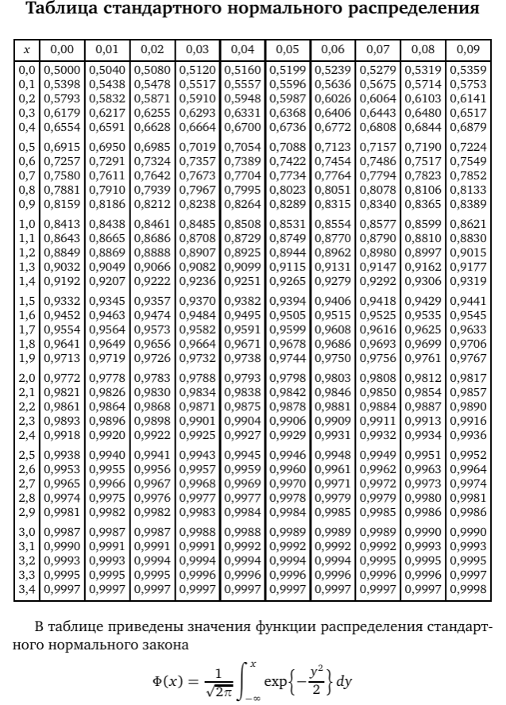

## Задача:
1. Известно, что генеральная совокупность распределена нормально со средним квадратическим отклонением, равным 16.
Найти доверительный интервал для оценки математического ожидания a с надежностью 0.95, если выборочная средняя M = 80, а объем выборки n = 256.  

---

## Решение:

Для нахождения доверительного интервала воспользуемся формулой:

Доверительный интервал = M ± Z_α/2 * (σ/√n),

где M - выборочная средняя, σ - среднее квадратическое отклонение генеральной совокупности, n - объем выборки, Z_α/2 - критическое значение нормального распределения с уровнем доверия α/2.

Так как надежность равна 0.95, то α = 1 - 0.95 = 0.05 и α/2 = 0.025.

Найдем критическое значение Z_α/2, используя таблицу значений нормального распределения или функцию обратной нормальной функции распределения в любом математическом пакете. Для α/2 = 0.025, необходимо найти значение z, такое что Φ(z) = 0.975. Из таблицы можно найти, что ближайшее значение z равно 1.96. Таким образом, для α/2 = 0.025, значение z равно 1.96.

Подставим значения в формулу:

Доверительный интервал = 80 ± 1.96 * (16/√256) = 80 ± 1.96 * 1 = [78.04; 81.96]

Итак, с вероятностью 0.95 можно утверждать, что истинное значение математического ожидания a лежит в интервале от 78.04 до 81.96.