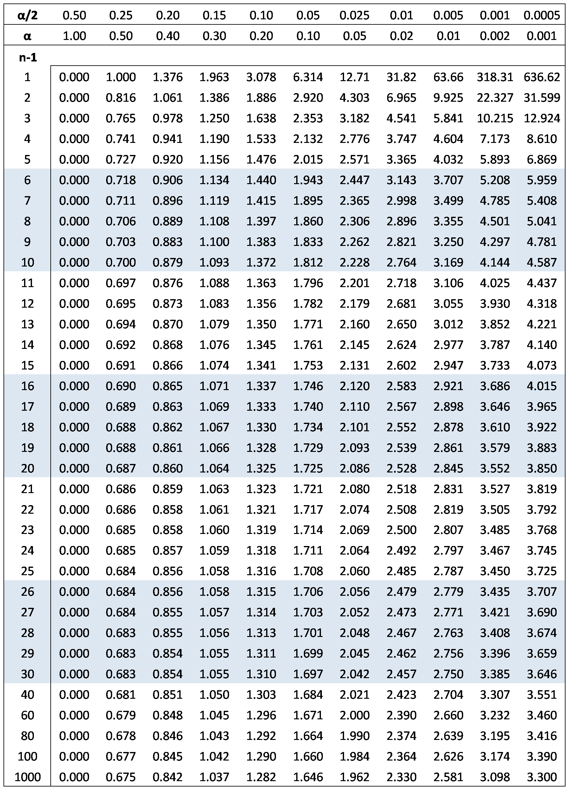

## Задача:

В результате 10 независимых измерений некоторой величины X, выполненных с одинаковой точностью, получены опытные данные:
6.9, 6.1, 6.2, 6.8, 7.5, 6.3, 6.4, 6.9, 6.7, 6.1   
Предполагая, что результаты измерений подчинены нормальному закону распределения вероятностей, оценить истинное значение величины X при помощи доверительного интервала, покрывающего это значение с доверительной вероятностью 0,95.

---

## Решение:

Сначала найдем выборочное среднее и выборочное стандартное отклонение:

Среднее:

X̄ = (6.9 + 6.1 + 6.2 + 6.8 + 7.5 + 6.3 + 6.4 + 6.9 + 6.7 + 6.1) / 10 = 6.5

Стандартное отклонение:

s = sqrt((1/(10-1))*((6.9-6.5)^2+(6.1-6.5)^2+(6.2-6.5)^2+(6.8-6.5)^2+(7.5-6.5)^2+(6.3-6.5)^2+(6.4-6.5)^2+(6.9-6.5)^2+(6.7-6.5)^2+(6.1-6.5)^2)) = 0.4138

Для нахождения доверительного интервала воспользуемся формулой:

Доверительный интервал = X̄ ± t_α/2 * (s/√n),

где X̄ - выборочное среднее, s - выборочное стандартное отклонение, n - объем выборки, t_α/2 - критическое значение распределения Стьюдента с (n-1) степенями свободы и уровнем доверия α/2.

Так как надежность равна 0.95, то α = 1 - 0.95 = 0.05 и α/2 = 0.025. Найдем критическое значение t_α/2, используя таблицу значений распределения Стьюдента или функцию обратной распределения Стьюдента в любом математическом пакете. Для (n-1) = 9 и α/2 = 0.025 значение t_α/2 = 2.262.

Подставим значения в формулу:

Доверительный интервал = 6.5 ± 2.262 * (0.4138/√10) = 6.5 ± 0.342

Итак, с вероятностью 0.95 можно утверждать, что истинное значение величины X лежит в интервале от 6.16 до 6.84.