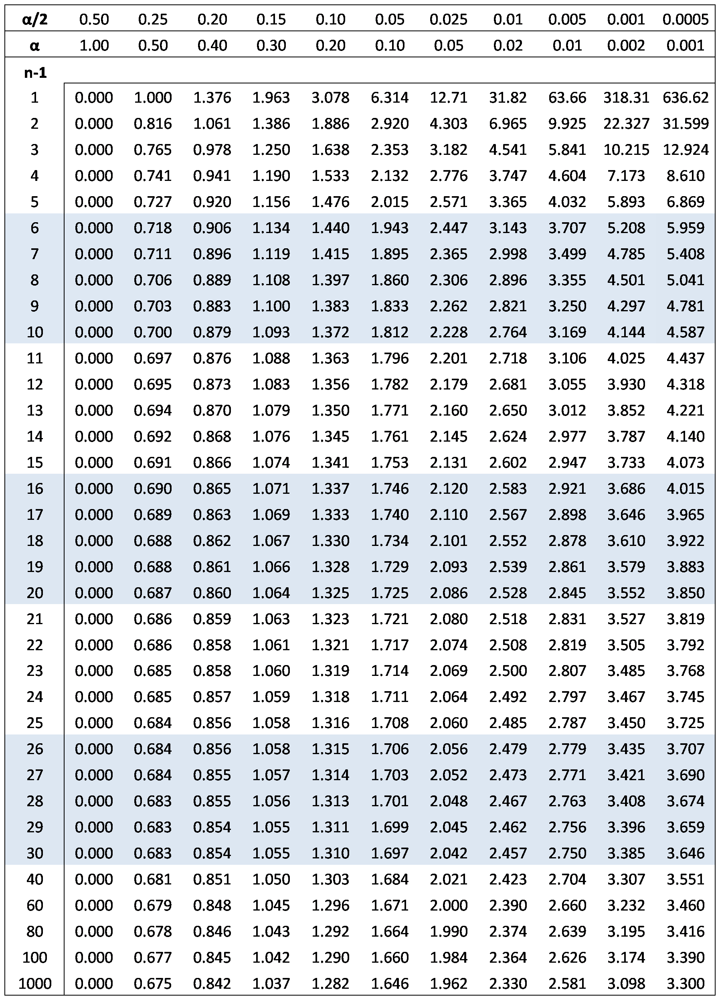

# Задача:

Рост дочерей 175, 167, 154, 174, 178, 148, 160, 167, 169, 170  
Рост матерей  178, 165, 165, 173, 168, 155, 160, 164, 178, 175.  
Используя эти данные построить 95% доверительный интервал для разности среднего роста родителей и детей.

---

## Решение:

Сначала найдем выборочные средние для роста дочерей и матерей:

Средний рост дочерей:
```
X̄_д = (175 + 167 + 154 + 174 + 178 + 148 + 160 + 167 + 169 + 170) / 10 = 166.2
```
Средний рост матерей:
```
X̄_м = (178 + 165 + 165 + 173 + 168 + 155 + 160 + 164 + 178 + 175) / 10 = 169.1
```
Затем найдем выборочные стандартные отклонения:

Стандартное отклонение для роста дочерей:
```
s_д = sqrt((1/(10-1))*((175-166.2)^2+(167-166.2)^2+(154-166.2)^2+...+(170-166.2)^2)) ≈ 10.75
```
Стандартное отклонение для роста матерей:
```
s_м = sqrt((1/(10-1))*((178-169.1)^2+(165-169.1)^2+(165-169.1)^2+...+(175-169.1)^2)) ≈ 6.21
```
Для нахождения доверительного интервала для разности средних используем формулу:
```
доверительный интервал = (X̄_д - X̄_м) ± t_α/2 * sqrt((s_д^2/n_д) + (s_м^2/n_м)),
```
где X̄_д и X̄_м - выборочные средние роста дочерей и матерей соответственно, s_д и s_м - выборочные стандартные отклонения для роста дочерей и матерей соответственно, n_д и n_м - объемы выборок для роста дочерей и матерей соответственно, t_α/2 - критическое значение распределения Стьюдента с (n_д + n_м - 2) степенями свободы и уровнем доверия α/2.



Так как надежность равна 0.95, то `α = 1 - 0.95 = 0.05 и α/2 = 0.025.` Найдем критическое значение t_α/2, используя таблицу значений распределения Стьюдента или функцию обратной распределения Стьюдента в любом математическом пакете. Для `(n_д + n_м - 2) = 18` и `α/2 = 0.025` значение `t_α/2 = 2.101`.

Подставим значения в формулу:
```
доверительный интервал = (166.2 - 169.1) ± 2.101 * sqrt((10.75^2/10) + (6.21^2/10)) ≈ (-6.278, 2.878)
```
Итак, с вероятностью 0.95 можно утверждать, что истинное значение разности среднего роста родителей и детей лежит в интервале от -6.278 до 2.878.